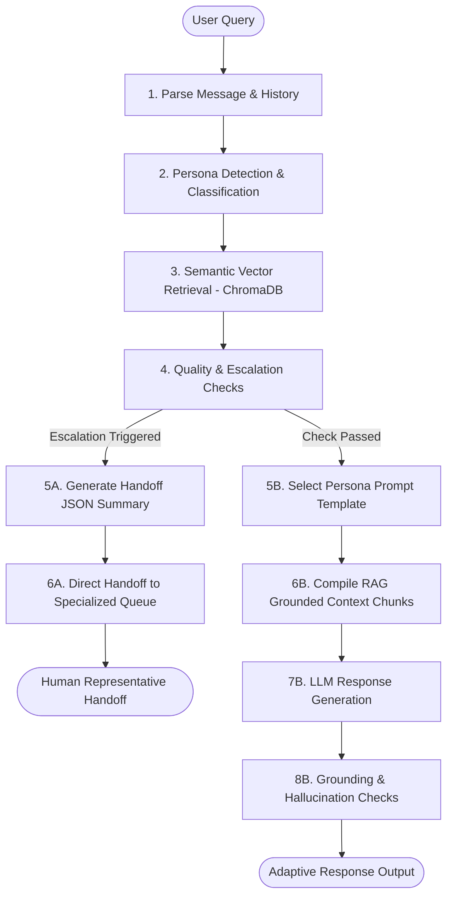

# Persona-Adaptive Customer Support Agent with Advanced RAG Architecture

A production-ready customer support agent built as an AI Engineering showcase. The system automatically identifies user personas (Technical Expert, Frustrated User, Business Executive), queries a persistent vector database of custom documents, dynamically adapts its response tone, and escalates to a human support agent when specific conditions are triggered.

---

## 1. Project Overview
This application acts as a customer support simulation for a SaaS/Infrastructure platform. It processes incoming user queries through a 10-step agentic pipeline:
1. Message parsing and history state collection.
2. Persona and sentiment classification.
3. Knowledge Base semantic retrieval.
4. Quality assessment checking.
5. Tone-appropriate template selection.
6. Grounded response generation.
7. Post-generation fact-check validations.
8. Escalation handling (generating structured handoff summaries).

---

## 2. Tech Stack & Versioning
- **Programming Language:** Python 3.12.0
- **Workflow / Interface:** Streamlit >= 1.30.0 (UI Dashboard)
- **Vector Database:** ChromaDB >= 0.4.22 (Persistent SQLite-based local Vector Store)
- **Large Language Model (LLM):** Google Gemini 1.5 Flash (via `google-generativeai` >= 0.3.2)
- **Embedding Model:** Google Gemini `models/embedding-001` (1536-dimensional semantic embeddings)
- **PDF Loader:** PyPDF >= 3.17.4
- **PDF Compiler:** ReportLab >= 4.0.8 (For creating mock documents programmatically)
- **Config & Environment:** Python Dotenv >= 1.0.0

---

## 3. Architecture Flow Diagram



---

## 4. Persona Detection Strategy
The system classifies users in real-time into three core personas:
1. **Technical Expert:** Requests specific logs, API configuration details, port configurations, and expects systematic root-cause analyses.
2. **Frustrated User:** Characterized by complaints, urgent requests, and emotional language.
3. **Business Executive:** Focuses on ROI metrics, SLA compliance, uptime values, and concise operational impact.

### Prompt Design
Classification utilizes a structured JSON schema instruction to enforce predictable JSON formatting. The LLM acts as a behavioral analyzer using the query and conversation history:
```json
{
  "primaryPersona": "Technical Expert" | "Frustrated User" | "Business Executive",
  "sentiment": -5 to +5,
  "emotion": "frustrated" | "anxious" | "angry" | "confused" | "neutral" | "satisfied" | "pleased",
  "urgency": "low" | "medium" | "high" | "critical",
  "complexity": "simple" | "moderate" | "complex" | "enterprise-critical",
  "language": "Detected Language"
}
```

---

## 5. RAG Pipeline Design
The Retrieval-Augmented Generation workflow is built to avoid hallucinations and verify document freshness:

### 1. Document Loading & Chunking
- Files are parsed from `docs/data/`. `pypdf` extracts pages from PDFs; markdown files are parsed header-by-header to maintain section boundaries.
- Text is split into chunks of **500 characters** with an overlap of **50 characters** to ensure semantic continuity across boundaries.

### 2. Embedding Model & Vector DB
- **Embedding Model:** Google Gemini API `models/embedding-001`.
- **Vector Database:** Persistent `chromadb` directory located at `./chroma_db`. Document metadata incorporates:
  - `source`: File basename (e.g. `billing_and_refund_policy.pdf`).
  - `location`: Specific Page (e.g. `Page 1`) or Section Header (e.g. `Authentication`).

### 3. Retrieval Strategy
- Submits queries to Chroma, generating embeddings dynamically.
- Distance metrics (L2/Cosine) are converted into normalized **Similarity Scores** between `0.0` and `1.0` (where `score = 1.0 / (1.0 + distance)`).
- Chunks are ranked descending, placing the most relevant sources first.

---

## 6. Configurable Escalation Logic
Conversations are redirected to human queues under the following automatic triggers:
1. **Low Confidence:** Top similarity score falls below the user-defined threshold (default `0.45`).
2. **Empty Retrieval:** No chunks match the search query (score < 0.15).
3. **Sensitive Actions:** Query matches billing issues, refund requests, legal privacy policies, or GDPR/account deletion.
4. **Repeated Frustration:** Customer is classified as a *Frustrated User* for 3+ consecutive chat turns.
5. **Conflict Unresolved:** Retrieval catches conflicting versions of the same advice (e.g. legacy documentation alongside current).
6. **Explicit Request:** User requests human support ("talk to an agent", "representative", "human").

### Escalation Queue Handoff
Escalations produce a structured summary payload with the target queue:
- `billing_support`: GDPR and Refund issues.
- `compliance_desk`: Legal policy reviews.
- `executive_relations_desk`: Long-term frustration and SLA outages.
- `technical_expert`: Complex server setups and API failures.

---

## 7. Setup & Installation Instructions

### Prerequisites
- Python 3.11 or higher (Tested on Python 3.12.0)
- Pip package manager
- Google Gemini API Key

### Installation

1. Clone or navigate to the repository directory:
   ```bash
   cd "c:/Users/Srikanth/OneDrive/Desktop/Persona Classification"
   ```

2. Create a virtual environment:
   ```bash
   python -m venv .venv
   ```

3. Activate the virtual environment:
   - **Windows PowerShell:**
     ```powershell
     .venv\\Scripts\\Activate.ps1
     ```
   - **macOS/Linux:**
     ```bash
     source .venv/bin/activate
     ```

4. Install dependencies:
   ```bash
   pip install -r requirements.txt
   ```

5. Set up your environment variables by creating a `.env` file in the root directory:
   ```env
   GEMINI_API_KEY="your-gemini-developer-key-here"
   ```

---

## 8. Run Guide

### 1. Ingest/Create Mock Documents
Run the generator script to construct the knowledge base `/docs/data` directory and compile the target PDF:
```bash
python create_mock_data.py
```

### 2. Ingest the Data Into Vector DB
You can either run the standalone script or click the **"Ingest Documents"** button in the Streamlit Sidebar:
```bash
python ingest.py
```

### 3. Launch Streamlit Web UI
```bash
streamlit run app.py
```
Open `http://localhost:8501` in your browser.

---

## 9. Example Queries
1. **Technical Expert:** *"Explain the API authentication 401 error and how the bearer config is set."*
2. **Frustrated User:** *"This system is completely broken and useless! I have been trying to set up my server port configs for three hours and need this fixed now!"*
3. **Business Executive:** *"What are our SLA uptime guarantees and credit calculations if monthly uptime drops?"*
4. **Billing Sensitive (Escalated):** *"I want a refund for my last invoice immediately."*
5. **Conflict Scenario (Escalated):** *"What database connection timeout threshold is recommended?"*
6. **Out-of-Scope (Escalated):** *"How do I bake bread at home?"* (Similarity score < 0.45).

---

## 10. Known Limitations & Future Roadmap
- **Stateless Vector Updates:** Chroma collections are completely rebuilt on re-ingest. Future improvements would support upsert operations to only process new files.
- **Local Embedding Speed:** Standard embeddings rely on network API requests. Supporting local embeddings (e.g. HuggingFace BGE embeddings) in production environments would reduce latency.
- **Multilingual Grounding:** Currently, language is detected, but responses are translated using LLM generation. Translating the knowledge base itself would ensure higher grounding quality.
